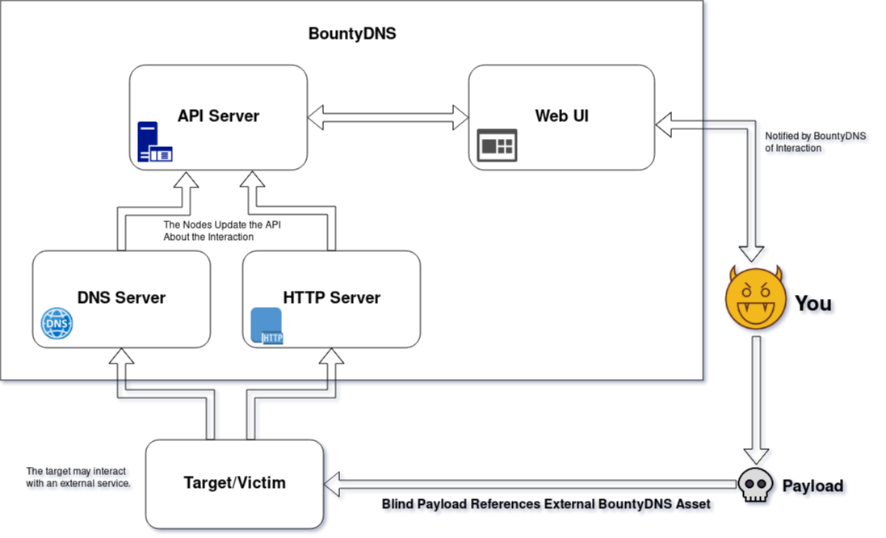
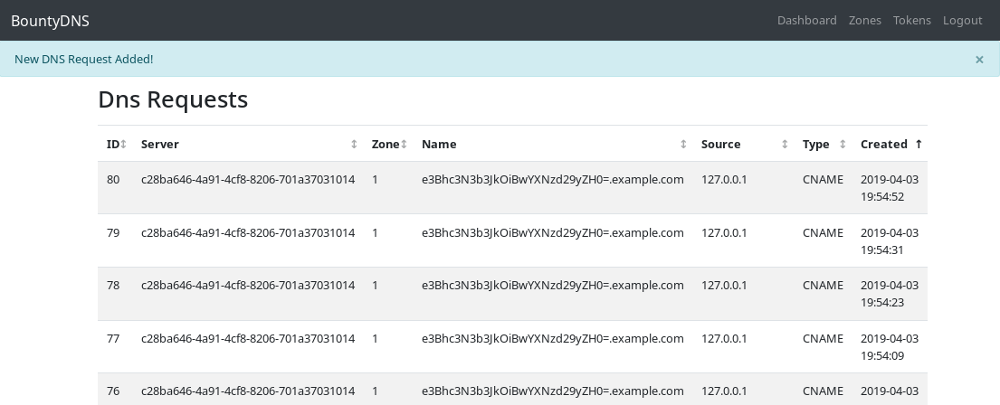
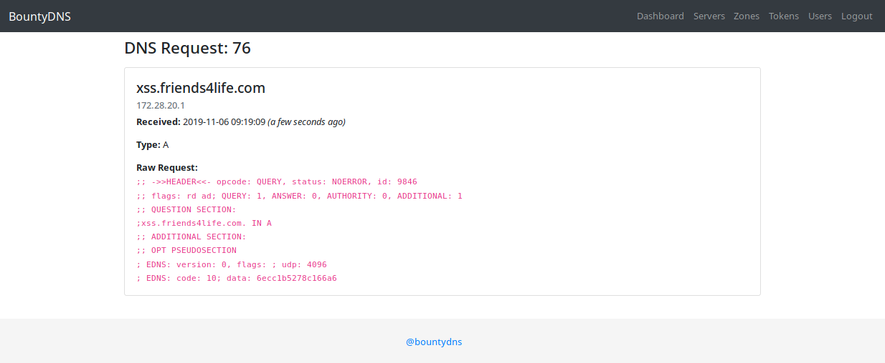
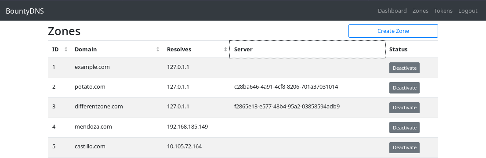

# Bounty DNS: A DNS Catcher



This project is an attempt to implement a lightweight burp collaborator-esc application and consists of two main components: a DNS Server (Custom Python Implemention with dnslib) and an API. It is still very much in the early days of development. You can think of BountyDNS as sort of a Canary that will notify you when an external asset (DNS Record, HTTP Server, SMTP Server) has been interacted with. This is useful for blind payload injection.

For more information on Burp Collaborator, checkout [burp's documentation](https://portswigger.net/burp/documentation/collaborator)

When answering queries, the DNS server hits the API with information regarding the DNS query. The API will then serve the log of the DNS queries via a RESTful HTTP API as well as front-end (HTML/JS) web GUI.

### Getting Started Quickly

Set the Environment variables

```
$ cd .env
$ cp x.env.example x.dev.env # alternatively x.prod.env
$ vim x.env #
```

## Building and Running

Make sure the environment is set appropriate for building. As of now the project can only automatically build for development. The build system uses docker and docker-compose to raise multiple services which the application requires.

### Building the Containers

Run the following to build and pull the containers.

```
$ ./compose.sh dev build
```

### Before Running any Commands

Go into the .env folder and copy all the examples to files with the ".example" extension removed. You will need to reference the next section to create a DNS API Token for the "dns.env" folder.

### Creating a DNS Token

Run the following to generate the API_TOKEN.

```
$ ./api-token.sh
```

Copy the relevant output to dns.env to set the API_TOKEN variable.

### Build the Frontend application

This is only required for development containers where the front end code is mounted.

```
$ cd bountydns/webui
$ npm install
$ npm run build

# alternatively, you can run watch to automatically rebuild the frontend

$ npm run watch
```

### Running the Services

Run the following to run the containers.

```
$ ./compose.sh dev up
```

## What does it do?

It doesn't do much really. The project will set up an API, a web interface, and a DNS server. When the DNS server receives a DNS request, it will tell the API. The API will then tell the web interface.



You can also see the raw request:



This information is useful for testing the injection of domains into payloads in attacks such as Blind Cross Site scripting, Remote File Inclusion, Blind SQL Injection, Blind XML External Entity Injection, and Server Side Request Forgery.

And that's basically it. A Burp Extension is in the works in the spirit of Collaborator Everywhere which will (hopefully) be used to inject targeted zones into web requests and poll the API for updates (like Collaborator). You can currently manage these "zones" within the web interface.



In addition, there's an Packer build and Terraform deployment in the "infra" folder for easy deploying.

## Developing and Hacking

The development Docker Compose project uses mounts to mount the correct folders and files onto the "bountydns" and "dns" containers. In addition, the command uses "--reload" so you can edit the python project on your host and automatically refresh the servers inside the containers.

The frontend WebUI application is also mounted. To setup automatic rebuilding, run the following:

```
$ cd bountydns/webui
$ npm run watch
```

You will still need to refresh the browser to view changes.

## About the Project

The following details the general outline for the future of this project.

## Phase 1: Build the PoC

The first iteration of the project will be a proof of concept to demonstrate the project's viability. At this point, the project should not be considered stable, secure, or feature complete.

Features:

- Create API Tokens via WebUI / CLI for Dns Servers
- Create Zones for Specific DNS Servers
- Log DNS Resolution

## Phase 2: Polish The Code

After demonstrating that the project is worth dedicating time to, Phase 2 will involve making the project feature complete with all clients (WebUI / CLI) and features (webhooks / email / queue) completed. At this point, the project should not be considered stable nor secure.

Features:

- Manage DNS Records through WebUI / API
- Ability to update the DNS server's records for running DNS Server (Polling)
- Receive Notifications on DNS Resolution via email or webhook
- Easily build the application with Docker, Packer, & Terraform

## Phase 3: Stability (Current)

Next, sanity checks and proper handlers will be put in place so that API calls fail gracefully. At this point the project should not be considered secure.

Features:

- Actual validation & Error Handling

## Phase 4: Release 0.1.0-alpha

Once I'm satisfied the code is not complete trash, I'll release it as version 0.1.0-alpha. At this point, the project should be considered secure enough to deploy. Though I'd recommend doing so in a protected network. If the application proves valuable enough to me personally or others, I'll continue to add features / improvements.

## Phase 5: Extending the Application

Once the core DNS use case is satisfied, the API will be extended to support the resolution of HTTP/S and SMTP requests.

TODO:

- [ ] Build HTTP Server
- [ ] Build SMTP Server
- [ ] Build ability for webhook's / events
- [ ] Fix logging / better logging
- [ ] Better config setup
- [ ] Gracefully allow actions when super is in token via ScopedTo
- [ ] Users can manage their own profile / user info
- [ ] Perform Better Validation
- [ ] Refactor code to handle General network errors via toast
- [ ] Add MFA
- [ ] Moar Vuex
- [ ] Make relationsips sortable in repo

### Contributing

If you're interested in contributing or collaborating, you can reach out to me on twitter @3lpsy or open a github issue.

```
usage: bdnsctl.py [-h]
                  {db-seed,seed,db-setup,setup,db-truncate,truncate,test,tests,api-token-create,api-token,api-token-list,api-tokens,dns-server,dns,user-create,user,user-list,users,api-login,login,api-server,api,api-urls,urls,api-user-create,api-user,api-user-list,api-users,api-zone-create,api-zone,api-zone-list,api-zones,zone-create,zone,zone-list,zones,alembic-current,al-current,alembic-downgrade,al-downgrade,alembic-history,al-history,alembic-init,al-init,alembic-migrate,al-migrate,alembic-show,al-show,alembic-stamp,al-stamp,alembic-upgrade,al-upgrade}
                  ...

positional arguments:
  {db-seed,seed,db-setup,setup,db-truncate,truncate,test,tests,api-token-create,api-token,api-token-list,api-tokens,dns-server,dns,user-create,user,user-list,users,api-login,login,api-server,api,api-urls,urls,api-user-create,api-user,api-user-list,api-users,api-zone-create,api-zone,api-zone-list,api-zones,zone-create,zone,zone-list,zones,alembic-current,al-current,alembic-downgrade,al-downgrade,alembic-history,al-history,alembic-init,al-init,alembic-migrate,al-migrate,alembic-show,al-show,alembic-stamp,al-stamp,alembic-upgrade,al-upgrade}
                        command
    db-seed (seed)      seed db
    db-setup (setup)    setup db
    db-truncate (truncate)
                        truncate db
    test (tests)        run tests
    api-token-create (api-token)
                        create api-tokens directly
    api-token-list (api-tokens)
                        list api-tokens via DB
    dns-server (dns)    run dns server
    user-create (user)  create users via DB
    user-list (users)   list users via DB
    api-login (login)   login via API
    api-server (api)    run api server
    api-urls (urls)     list api urls
    api-user-create (api-user)
                        create user via API
    api-user-list (api-users)
                        list users via API
    api-zone-create (api-zone)
                        create user via API
    api-zone-list (api-zones)
                        list zones via API
    zone-create (zone)  create zones via DB
    zone-list (zones)   list zones via DB
    alembic-current (al-current)
                        run alembic current
    alembic-downgrade (al-downgrade)
                        run alembic downgrade
    alembic-history (al-history)
                        run alembic history
    alembic-init (al-init)
                        run alembic init
    alembic-migrate (al-migrate)
                        run alembic migrate
    alembic-show (al-show)
                        run alembic show
    alembic-stamp (al-stamp)
                        run alembic stamp
    alembic-upgrade (al-upgrade)
                        run alembic upgrade
    user-create (user)  create users via DB
    user-list (users)   list users via DB
    alembic-current (al-current)
                        run alembic current
    alembic-downgrade (al-downgrade)
                        run alembic downgrade
    alembic-history (al-history)
                        run alembic history
    alembic-init (al-init)
                        run alembic init
    alembic-migrate (al-migrate)
                        run alembic migrate
    alembic-show (al-show)
                        run alembic show
    alembic-stamp (al-stamp)
                        run alembic stamp
    alembic-upgrade (al-upgrade)
                        run alembic upgrade
    zone-create (zone)  create zones via DB
    zone-list (zones)   list zones via DB
    api-login (login)   login via API
    api-server (api)    run api server
    api-urls (urls)     list api urls
    api-user-create (api-user)
                        create user via API
    api-user-list (api-users)
                        list users via API
    api-zone-create (api-zone)
                        create user via API
    api-zone-list (api-zones)
                        list zones via API
    api-token-create (api-token)
                        create api-tokens directly
    api-token-list (api-tokens)
                        list api-tokens via DB
    dns-server (dns)    run dns server

optional arguments:
  -h, --help            show this help message and exit
```
